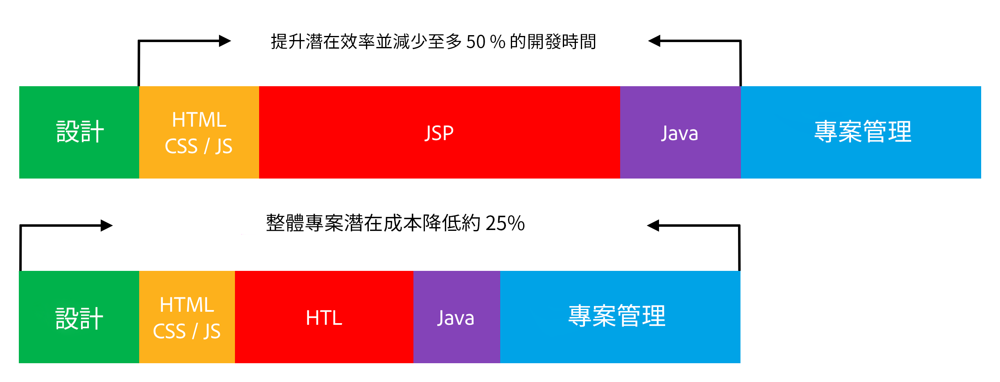

# 概觀 {#overview}

Adobe Experience Manager (AEM)支援的HTML範本語言(HTL)旨在提供高生產力的企業級網頁架構，進而增強安全性。 此外，也讓不具備Java知識的HTML開發人員更能參與AEM專案。

[在AEM 6.0](history.md)中引入了HTML範本語言，這是AEM中首選且推薦使用的HTML伺服器端範本系統。 對需要建立強大企業網站的網頁開發人員而言，HTML 範本語言有助於提升安全性和開發效率。

## 提升安全性 {#increased-security}

HTML範本語言(HTL)藉由自動套用上下文感知逸出到所有輸出變數來增強網站安全性，使其比大多數其他範本系統更安全。 HTL之所以能做到這點，是因為其瞭解HTML語法，並運用相關知識，根據運算式在標籤中的位置調整其必要逸出。 此方法可能會造成置於`href`或`src`屬性中的運算式，與其他屬性或其他位置的運算式產生不同逸出。

雖然使用 JSP 等範本語言可以達到相同結果，但開發人員必須手動操作，才能確保適當的逸出套用至每個變數。由於套用的逸出只要一有遺漏或錯誤，就可能足以造成跨網站指令碼(XSS)出現弱點，Adobe決定使用HTL將此工作自動化。 如有必要，開發人員仍可在運算式上指定其他逸出，但使用 HTL 的話，預設行為更可能對應到希望的行為，減少發生錯誤的機率。

## 簡化開發工作 {#simplified-development}

HTML 範本語言簡單易學，其功能刻意有所限制，以確保其簡單明瞭。此外，這種範本語言也有強大機制足以建立標記架構及叫用邏輯，同時一律強制分割標記和邏輯面向。HTL是標準HTML5，使用運算式和資料屬性來註解具有動態行為的標籤。 此方法可維持標籤的有效性和可讀性。 運算式和資料屬性的評估完全在伺服器端進行，使用者端看不到，因此使用者端可以不受干擾地使用想要的JavaScript架構。

這些功能可讓不具備Java知識的HTML開發人員編輯HTL範本、整合到開發團隊中，並簡化與全端Java開發人員的協同合作。 反之亦然，它可讓Java開發人員專注於後端程式碼，而不需擔心HTML。

## 降低成本 {#reduced-costs}

提升安全性、簡化開發工作並改善團隊共同作業，都能讓AEM專案事半功倍、縮短上市時間(TTM)，並降低總體擁有成本(TCO)。

使用HTML範本語言重新實作Adobe.com網站顯示，專案成本和持續時間最多可減少約25%。

上圖顯示HTL提升效率的下列成效：

* **HTML/CSS/JS：** HTML開發人員可直接編輯HTL範本，允許前端設計直接在AEM元件上實作，而不需要個別實作。 此方法可減少痛苦的迭代作業，裨益全端Java開發人員。
* **JSP / HTL：**&#x200B;由於HTL本身不需搭配任何Java知識，且容易撰寫，因此所有具備HTML專業的開發人員都能編輯這類範本。
* **Java:** HTL 提供清楚且易於使用的 Use-API，讓具商業邏輯的介面更清晰明瞭，同時有助於整體 Java 開發。

## 影片介紹 {#video}

以下影片取自[AEM Gems研討會](https://experienceleague.adobe.com/en/docs/events/experience-manager-gems-recordings/gems2014/aem-introduction-to-htl)，概要說明HTL的用途以及實施範例。

>[!VIDEO](https://video.tv.adobe.com/v/19504/?quality=9)

請注意，影片中提到HTL時，[是指HTL先前的名稱Sightly](history.md)。

## 後續步驟 {#next-steps}

現在您已經瞭解HTL的目的和優點，您可以開始使用語言了。 請參閱[開始使用HTML範本語言](getting-started.md)。
